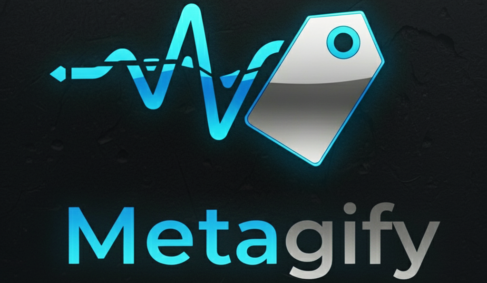
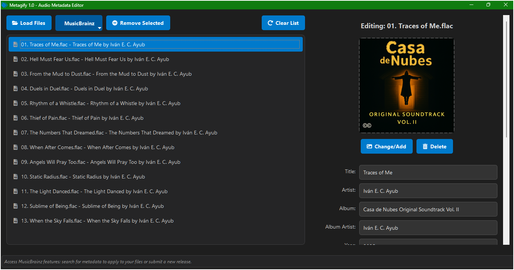
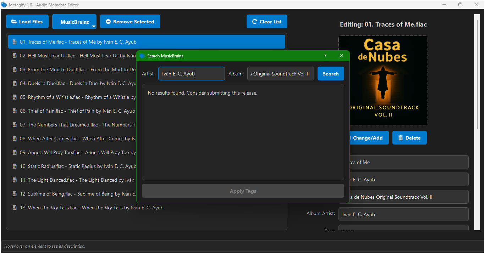
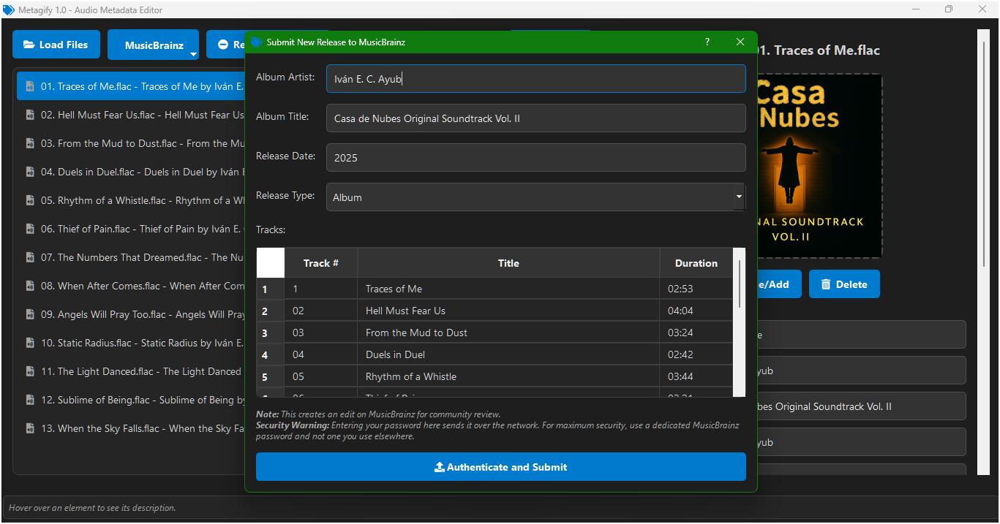

### _An Enhanced Audio Metadata Editor_

_A professional, feature-rich tool for managing your music collection's tags and album art._

---

**Metagify** is a modern, open-source desktop application designed to provide a streamlined solution for editing audio file metadata. Built with Python and PyQt5, it offers a powerful and intuitive interface for single-file and batch-editing of tags, as well as seamless integration with the MusicBrainz database.

Version **1.0** introduces a robust and user-friendly interface with an improved dark theme and an interactive file list that makes managing large music libraries easier than ever.

---

## 📥 Download Program v1.0 (.EXE)

Get the latest stable release from:

<table>
  <tr>
    <td align="center">
      
    </td>
    <td align="center">
      
    </td>
  </tr>
</table>

---

## ✨ Key Features

- **Intuitive UI** – A redesigned two-panel interface with a modern, professional dark theme and a contextual help system that displays descriptions on hover.
- **Interactive File List** – Drag-and-drop to add files, reorder tracks, and use multi-selection for efficient batch editing.
- **Batch Editing** – Apply changes to multiple files at once, including tags and album art.
- **MusicBrainz Integration** – Automatically fetch comprehensive metadata, including album, artist, and track information, from the MusicBrainz database.
- **Album Art Management** – Easily add, change, or delete album art for your files.
- **Multiple Format Support** – Supports popular audio formats including **MP3, FLAC, M4A, and Ogg**.
- **Community Contribution** – Submit metadata for new releases directly to MusicBrainz for community review.

---

## 🆕 v1.0

- **Initial Stable Release** - The first public version of Metagify, bringing a full-featured audio metadata editor to the desktop.
- **Improved Color Palette** - A new, professional dark theme for a more comfortable user experience.
- **Enhanced File Handling** - Robust file loading with graceful error handling for unreadable files.
- **Contextual Help System** - Hover over any element to see a brief description of its function.

---

## 🖼️ Interface Previews

**Main Window**
_A two-panel layout featuring a draggable file list on the left and a detailed tag editor on the right, including a resizable album art preview._

**Search MusicBrainz Dialog**
_A clean search interface for querying the MusicBrainz database by artist and album, displaying a list of matching releases._

---

## 🚀 How to Use

1. **Load Media** – Drag and drop audio files or use the **"Load Files"** button to import your music.
2. **Select Files** – Choose one or more files from the list to begin editing.
3. **Edit Metadata** – Manually enter tag information or use the **"MusicBrainz"** button to automatically fetch data.
4. **Save Changes** – Click **"Save Changes"** to write the new metadata and album art to your files.

---

## 📊 Integrated Technologies & Licenses

| Technology          | License          | Source                                                        |
| :------------------ | :--------------- | :------------------------------------------------------------ |
| **Python**          | PSF License      | [Official Site](https://www.python.org)                       |
| **PyQt5**           | GPL / Commercial | [Official Site](https://www.qt.io)                            |
| **Mutagen**         | GPL / LGPL       | [GitHub](https://github.com/quodlibet/mutagen)                |
| **MusicBrainz NGS** | MIT              | [GitHub](https://github.com/metabrainz/python-musicbrainzngs) |
| **Qtawesome**       | MIT              | [GitHub](https://github.com/spyder-ide/qtawesome)             |
| **Requests**        | Apache 2.0       | [GitHub](https://github.com/psf/requests)                     |

---

## 🤝 Contributions

We welcome contributions from the community, whether through bug reports, feature suggestions, or code submissions. Please check our GitHub repository for more information.

📧 Contact: **[negroayub97@gmail.com](mailto:negroayub97@gmail.com)**

---

## 📜 License

© 2025 Iván Eduardo Chavez Ayub
Licensed under **MIT**.

