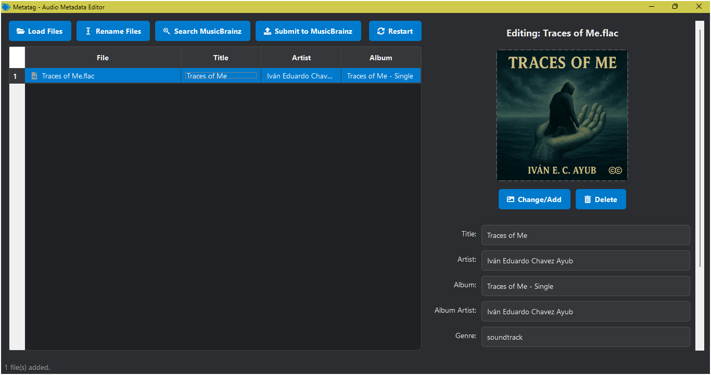
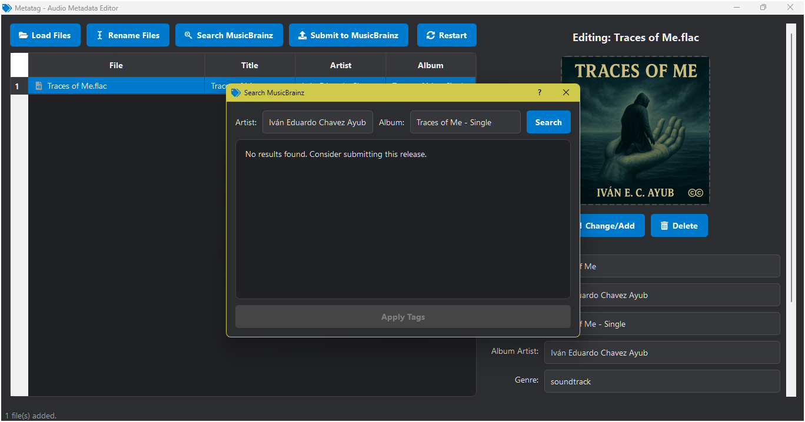
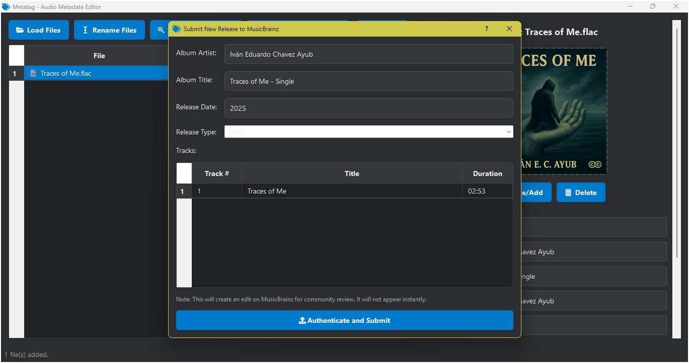

Download the EXE from Google Drive: https://drive.google.com/file/d/1noVr8WXN2tWL-xoOV3PKoUF0mCyapiUl/view?usp=sharing

A modern audio metadata editor with **MusicBrainz** integration, cover art support, and an intuitive interface

---

## Contributions

Contributions are welcome!

1. Fork the repository.
2. Create a branch for your feature or fix.
3. Submit a Pull Request with a clear description.

For bug reports or suggestions, contact me at: [negroayub97@gmail.com](mailto:negroayub97@gmail.com).

---

## 📸 Interface Preview

### 🔹 General Interface

### 🔹 MusicBrainz Search

### 🔹 MusicBrainz Submission

---

## ✨ Key Features

### 🎧 Metadata Editing

- Supports `.mp3`, `.flac`, `.m4a`, `.ogg` files
- Edit title, artist, album, year, genre, track number, comments

### 🖼️ Album Art

- Add, change, or remove cover art
- Preview embedded artwork
- Supports `.jpg`, `.png` images

### 🌐 MusicBrainz Integration

- Search and auto-apply metadata from MusicBrainz
- Submit new releases directly from the app

### 🧠 Automation

- Rename files using custom patterns
- Autofill forms using existing metadata
- Visual indicators for unsaved changes

### 🛡️ Error Handling

- Safe error recovery
- Robust handling of malformed files

---

## 🛠️ Development Status — v3.0

| Component            | Status         | Notes                                                  |
| -------------------- | -------------- | ------------------------------------------------------ |
| Metadata Editing     | 🟢 Complete    | Per-field editing, supports multiple formats           |
| Album Art            | 🟢 Complete    | Preview + editing integrated                           |
| MusicBrainz (Search) | 🟢 Complete    | Search by artist/album, select and apply release       |
| MusicBrainz (Submit) | 🟡 Functional  | Requires authentication, community-reviewed submission |
| File Renaming        | 🟢 Complete    | Pattern-based renaming like `%artist% - %title%`       |
| GUI Interface        | 🟢 Improved    | Dark theme, responsive layout                          |
| Drag & Drop          | 🟢 Implemented | Drag files directly into the table                     |

---

## 🎮 How to Use

1. Launch the app.

2. Select your audio files using the **"Load Files"** button.

3. Select a file to edit its metadata individually.

4. Optional: Use MusicBrainz search or submit a new release from within the app.

---

## 📦 Dependencies

### Core

- `PyQt5` (>=5.15.0)
- `mutagen` (>=1.45.1)
- `musicbrainzngs` (>=0.7.1)
- `qtawesome`
- `requests`

---

## 🔥 Recent Enhancements

- ✅ MusicBrainz submission from within the interface
- ✅ Smart file renaming
- ✅ Search and apply metadata
- ✅ Visual cover art editor

---

## ⚠️ Known Issues

- MusicBrainz submission requires authentication and may fail due to API issues
- Large files may cause performance issues

---

## 💻 System Requirements

- Python 3.7+
- All listed dependencies installed
- A working `ffmpeg` setup in the system

---

## 📄 License

Distributed under the **[MIT License](LICENSE)**.

---

## 👤 Author

**Iván Eduardo Chavez Ayub**
🔗 [GitHub](https://github.com/Ivan-Ayub97)
📧 [negroayub97@gmail.com](mailto:negroayub97@gmail.com)
🛠️ Tech: Python, PyQt5, mutagen, MusicBrainz API

---

## 🌟 Why Metatag?

Because you need a **simple, powerful, and beautiful** metadata editor.
Metatag is an **open, intuitive, and evolving** tool built with creators in mind.
